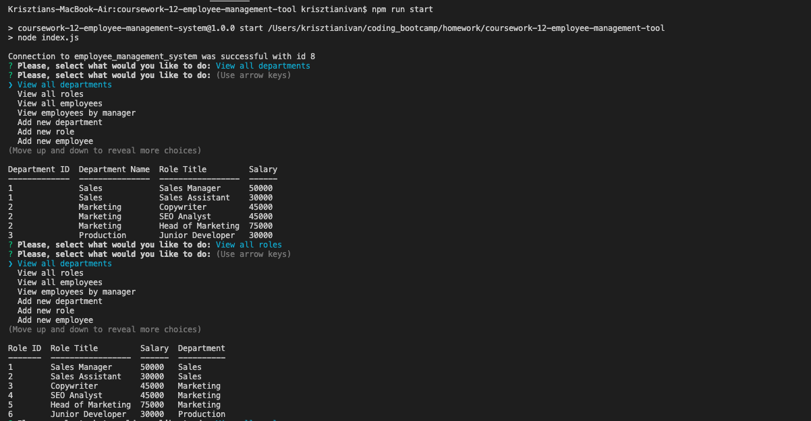
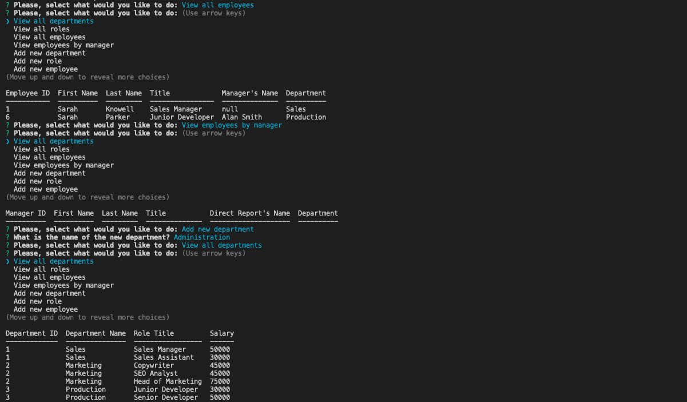
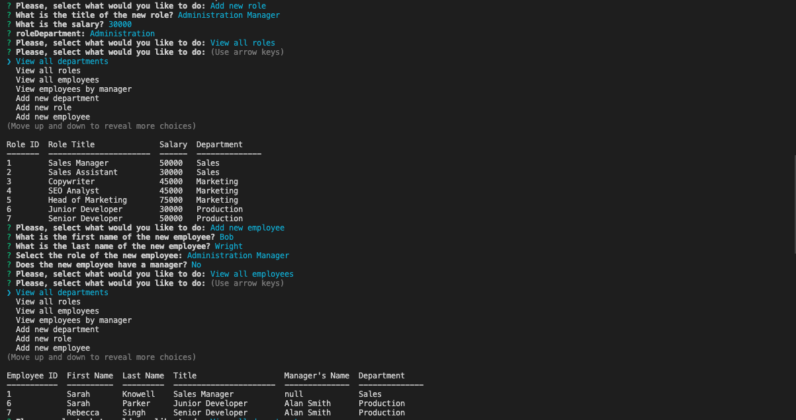
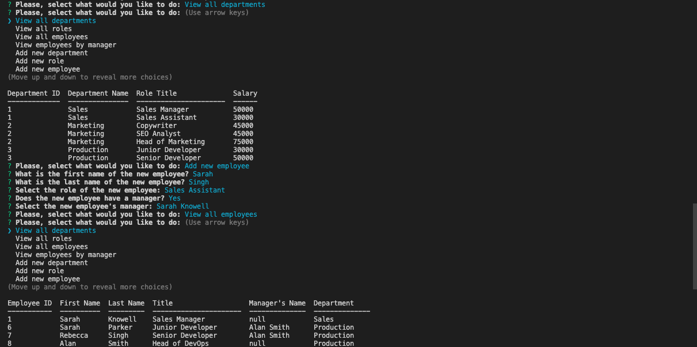
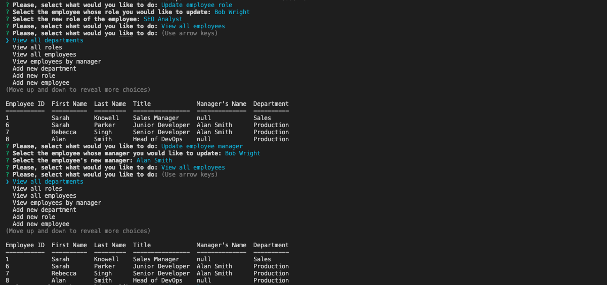
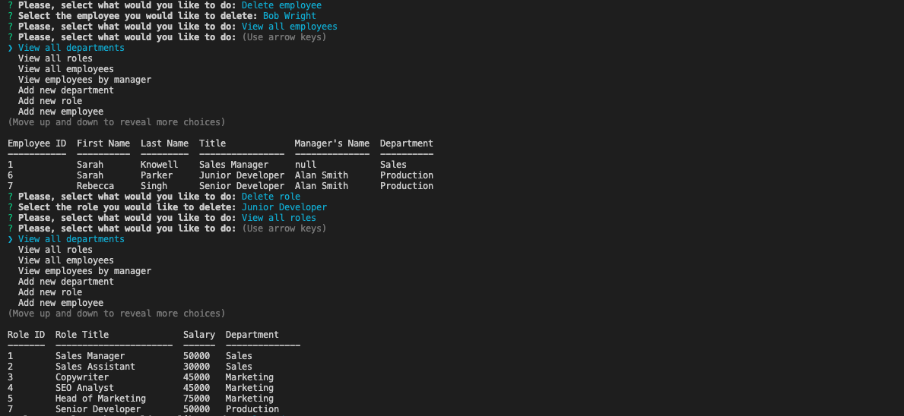
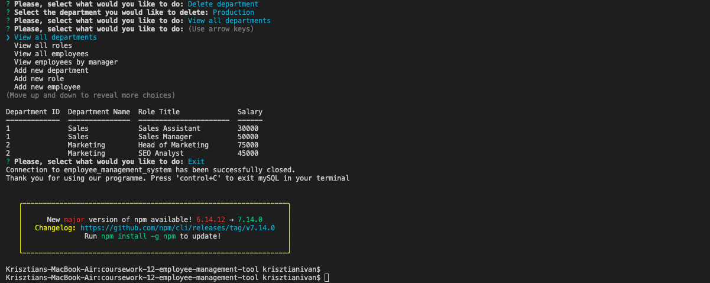

# Employee Management CMS Tool

## Description

In this project I have created a command line application that connects to a local mySQL database and allow a user to manage departments, roles and employees within an organisation through interactions with the database.

## What I have done

- [x] Created the schema for the database that allows the user to initialise it on their local database server
- [x] Created seed files for the database to enable testing of functionality
- [x] Created a utility class that manages interactions with the mySQL database and is reusable in other applications
- [x] Added a package.json file to manage dependencies
- [x] Added functionality to create, read, update and delete data

## Installation

```
git clone https://github.com/ivnkris/employee-management-cms-tool.git
cd employee-management-cms-tool
npm install
npm run start
```

## Contributing

Submit a pull request

## Scripts

```
npm run start
```

## Link to GitHub repository

https://github.com/ivnkris/employee-management-cms-tool

## Link to walkthrough video

https://drive.google.com/file/d/1S_FCgZxrhpwuAyelBArLtsuc1j7T7AvG/view

## Screenshots









## Questions

- Send any questions via my [GitHub profile](https://github.com/ivnkris)
